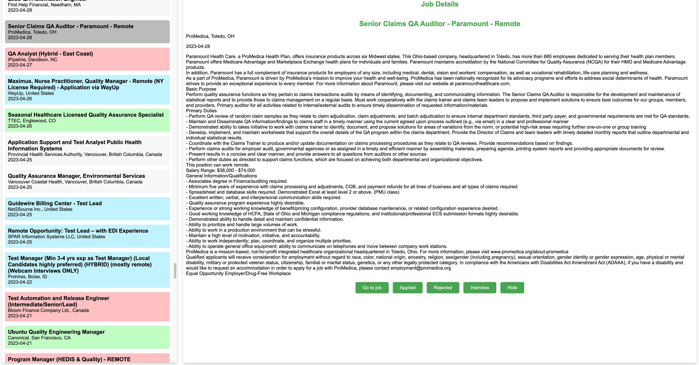

# LinkedIn Job Scraper

A Python-based web application that automates LinkedIn job scraping and provides an intelligent job management interface. This tool helps job seekers efficiently track, filter, and manage job applications while avoiding duplicate and irrelevant postings.



## Overview

Job searching on LinkedIn can be frustrating due to repetitive results, irrelevant postings, and poor sorting algorithms. This application addresses these pain points by:

- **Eliminating duplicates**: No more seeing the same job posting multiple times
- **Smart filtering**: Remove irrelevant jobs based on customizable keywords
- **Chronological sorting**: Jobs sorted by actual posting date, not LinkedIn's relevance algorithm
- **Application tracking**: Mark jobs as applied, rejected, interview, or hidden
- **Clean interface**: No sponsored posts or algorithmic noise

## ⚠️ Important Legal Notice

**LinkedIn's Terms of Service prohibit automated scraping of their platform. Use this tool at your own risk and discretion. Consider using proxy servers to minimize detection risk.**

## Features

- **Automated Scraping**: Configurable search queries with multiple filter options
- **Database Storage**: SQLite database for persistent job data storage
- **Web Interface**: Clean, responsive Flask-based UI for job management
- **Advanced Filtering**: Filter by title keywords, company names, job descriptions, and languages
- **Application Status Tracking**: Visual indicators for application status
- **Proxy Support**: Built-in proxy configuration for enhanced privacy

## Prerequisites

- Python 3.6+
- Required Python packages (see `requirements.txt`)

## Installation

1. **Clone the repository**
   ```bash
   git clone https://github.com/danieladdisonorg/Linked-in-Scraping.git
   cd Linked-in-Scraping
   ```

2. **Install dependencies**
   ```bash
   pip install -r requirements.txt
   ```

3. **Configure the application**
   - Copy `config_example.json` to `config.json`
   - Update configuration parameters (see Configuration section)

4. **Initialize the database**
   ```bash
   python main.py
   ```

5. **Launch the web interface**
   ```bash
   python app.py
   ```

6. **Access the application**
   - Open your browser to `http://127.0.0.1:5000`

## Usage

### Scraping Jobs

The scraper (`main.py`) performs the following operations:
- Searches LinkedIn based on your configured queries
- Applies intelligent filtering to remove irrelevant postings
- Stores clean, deduplicated results in SQLite database
- Supports multiple search rounds for comprehensive coverage

### Managing Applications

The web interface (`app.py`) provides:
- **Applied** (Blue highlight): Track submitted applications
- **Interview** (Green highlight): Mark interview opportunities
- **Rejected** (Red highlight): Track rejections
- **Hidden**: Remove jobs from view permanently

## Configuration

Create a `config.json` file with the following structure:

```json
{
  "proxies": {
    "http": "http://proxy-server:port",
    "https": "https://proxy-server:port"
  },
  "headers": {
    "User-Agent": "Your-User-Agent-String"
  },
  "OpenAI_API_KEY": "your-openai-api-key",
  "OpenAI_Model": "gpt-4",
  "resume_path": "/path/to/your/resume.pdf",
  "search_queries": [
    {
      "keywords": "software engineer",
      "location": "San Francisco, CA",
      "f_WT": "2"
    }
  ],
  "title_include": ["engineer", "developer"],
  "title_exclude": ["senior", "lead"],
  "company_exclude": ["Company Name"],
  "desc_words": ["unwanted", "keywords"],
  "languages": ["en"],
  "timespan": "r604800",
  "pages_to_scrape": 5,
  "rounds": 3,
  "days_toscrape": 7,
  "jobs_tablename": "jobs",
  "filtered_jobs_tablename": "filtered_jobs",
  "db_path": "jobs.db"
}
```

### Configuration Parameters

| Parameter | Description | Values |
|-----------|-------------|---------|
| `f_WT` | Work type filter | `0` (onsite), `1` (hybrid), `2` (remote), empty (any) |
| `timespan` | Job posting age | `r604800` (1 week), `r86400` (24 hours) |
| `languages` | Accepted languages | ISO codes: `en`, `de`, `fr`, `es`, etc. |
| `rounds` | Scraping iterations | Recommended: 2-5 for comprehensive coverage |

## Architecture

```
├── main.py              # Scraping engine
├── app.py               # Flask web application
├── config.json          # Configuration file
├── requirements.txt     # Python dependencies
├── jobs.db             # SQLite database (generated)
└── templates/          # HTML templates
```

## Roadmap

### Planned Features
- [ ] **Reversible Actions**: Ability to unhide and modify application status
- [ ] **Enhanced Sorting**: Sort by database insertion date
- [ ] **UI Configuration**: Web-based search configuration
- [ ] **Bulk Operations**: Mass status updates and filtering
- [ ] **Export Functionality**: CSV/Excel export capabilities
- [ ] **Analytics Dashboard**: Application tracking statistics

### Known Limitations
- Some jobs may appear in search results days after posting (LinkedIn limitation)
- Status changes are currently irreversible through the UI
- Configuration requires manual JSON editing

## Contributing

We welcome contributions! Please follow these steps:

1. Fork the repository
2. Create a feature branch (`git checkout -b feature/amazing-feature`)
3. Commit your changes (`git commit -m 'Add amazing feature'`)
4. Push to the branch (`git push origin feature/amazing-feature`)
5. Open a Pull Request

For major changes, please open an issue first to discuss your proposed modifications.

## License

This project is licensed under the MIT License - see the [LICENSE](LICENSE) file for details.

## Disclaimer

This tool is for educational and personal use only. Users are responsible for complying with LinkedIn's Terms of Service and applicable laws. The authors assume no liability for any misuse of this software.

---

**⭐ If this project helps you in your job search, please consider giving it a star!**
